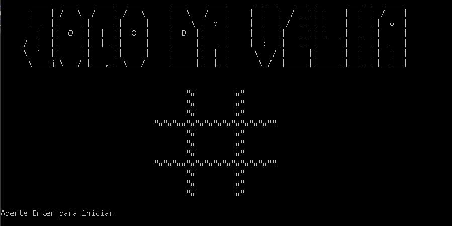

# Recriando o Jogo da Velha em C#

Este jogo foi desenvolvido em C# para ser executado no console, permitindo que dois jogadores joguem alternadamente, seguindo todas as regras do famoso Jogo da velha.

#

## Como jogar?
1. Na tela inicial Digitar Enter ou qualquer tecla.
2. Digitar o nome do jogador 1.
3. Digitar o nome do jogardor 2.
4. Podemos escolher se vamos sortear quem deve começar apertando S - sim ou N - não.
5. Será exibido um tabuleiro.

              1 |  2  |  3
                |     |
            ----------------
                |     |
              4 |  5  |  6
                |     |
            ----------------
                |     |
              7 |  8  |  9
                |     |

6. O jogo irá infomar quem deve começar, caso tenha escolhido  por não sortear ele começa pelo jogador1.
7. Basta digitar a posição de 1 a 9 conforme exibido no console.
8. No fim do jodo ele exibe o nome do vencedor ou empate.
